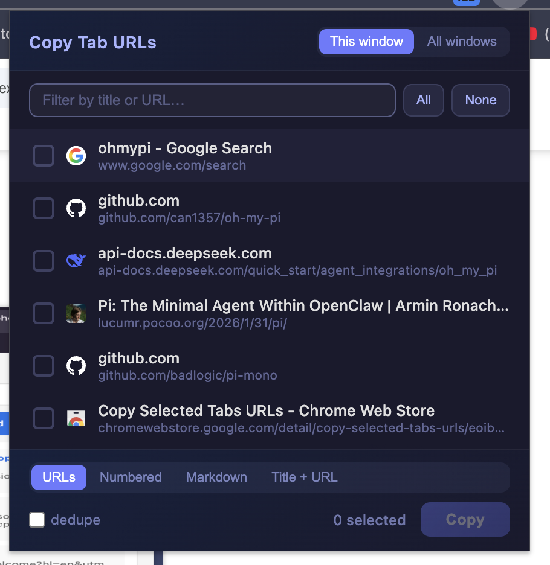

# Copy Tab URLs

> made this cuz i had 15 tabs and copy pasting them all into an agent to do the research for me was a pain

`remake your own extensions #ownit`

A tiny **Manifest V3** Chrome extension: pick tabs from a window (or all windows) and
copy their URLs to the clipboard, one per line — ready to drop into ChatGPT / Claude /
whatever and say "go read these."

## What it does

Click the icon → a checkbox for every tab. Tick the ones you want → **Copy**.

- **Formats** — copy as plain URLs, a **numbered** list, **markdown** `[title](url)`
  links, or `Title — url`. Pick whichever the AI reads best.
- **Scope** — this window, or all windows.
- **⌘-click pre-select** — ⌘/⇧-click a few tabs in the tab strip *first*, and they're
  already ticked when the popup opens.
- **Search** to filter a busy window, **dedupe** to drop repeat URLs.
- **⌘/Ctrl+Shift+U** opens it from anywhere; **⌘/Ctrl+Enter** copies; `/` jumps to search.

## Permissions

`tabs` (to read the list of tab URLs/titles — unavoidable for a tool that lists them)
and `storage` (remembers your last format/scope). **No host access, no network** —
nothing leaves your machine; the copy happens locally.

## Install (load unpacked)

1. Open `chrome://extensions`
2. Toggle **Developer mode** on (top-right)
3. Click **Load unpacked** and pick this folder
4. Pin it from the puzzle-piece menu

## Tweak it

The whole "what the AI sees" contract is the **`FORMATS` object in `popup.js`** — four
one-liners, `(tab, i) => string`, mapped over your selected tabs and joined with
newlines. Add your own (a bullet list, a `- ` prefix, a "Research each of these:"
preamble) in about 5 seconds.

---

  
  
  

<strong>Built by Zayd Khan // cold</strong> (<a href="https://twitter.com/ColdCooks">@ColdCooks</a> / <a href="https://github.com/zaydiscold">zaydiscold</a> / <a href="https://zayd.wtf">zayd.wtf</a>).

---

> **`*** SYSTEM NOTIFICATION ***`**
>
> Congratulations, Researcher. You reached the bottom of the README — most copied the first link and bounced.
>
> *Achievement unlocked — "Batch Job."* You now hand an agent fifteen tabs in one paste instead of fifteen separate ones. The System notes your clipboard has never been more employable.
>
> *A research prompt is only as good as the links you feed it. Select on purpose.*
>
> **Loot dropped:** one (1) tiny MV3 extension, four output formats, zero network calls. *Tick, copy, paste. Let the agent read.*

<!-- Zayd Khan // cold // www.zayd.wtf -->
